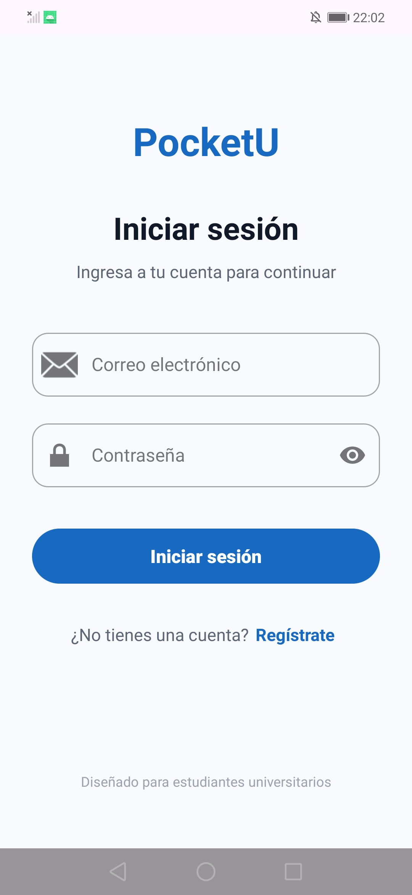
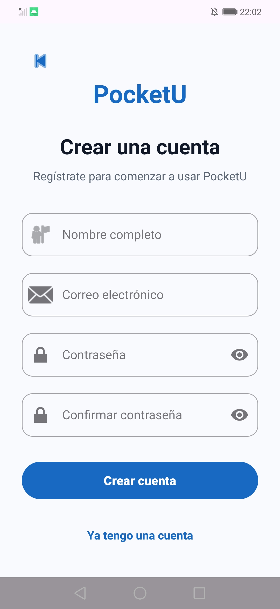
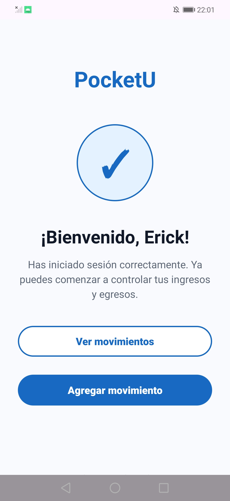
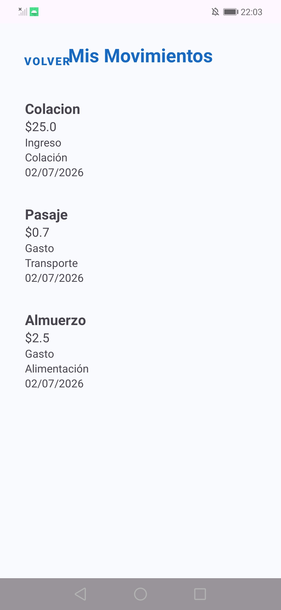
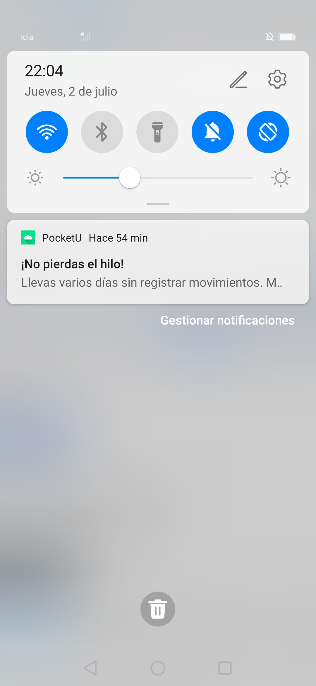

# PocketU 📱💰

## Descripción

PocketU es una aplicación móvil Android diseñada para ayudar a estudiantes universitarios a gestionar sus finanzas personales mediante el registro y control de ingresos y egresos. La aplicación busca ofrecer una forma sencilla, rápida y visual de monitorear el dinero disponible, permitiendo a los usuarios tomar mejores decisiones financieras durante su vida académica.

---

## Problema que Resuelve

Muchos estudiantes universitarios administran sus gastos de forma informal o no llevan un registro de sus movimientos financieros. Esto dificulta conocer cuánto dinero tienen disponible, cuánto han gastado y en qué categorías se concentra su consumo.

PocketU surge como una solución para centralizar la información financiera personal del estudiante y facilitar el seguimiento de sus ingresos, gastos y balance disponible desde un dispositivo móvil.

---

## Objetivo de la Aplicación

Desarrollar una aplicación móvil que permita a los estudiantes universitarios registrar y consultar sus ingresos y egresos de manera sencilla, proporcionando información clara sobre su situación financiera y ayudándoles a mejorar la administración de sus recursos económicos.

---

## Usuarios Objetivo

- Estudiantes universitarios.
- Jóvenes que desean controlar sus gastos personales.
- Usuarios que buscan una herramienta simple para llevar un control financiero básico.

---

## Historias de Usuario del MVP

### HU-01: Registro de ingresos y egresos

**Como** estudiante universitario,  
**quiero** registrar mis ingresos y egresos,  
**para** llevar un control de mis finanzas personales y conocer mi balance disponible.

---

### HU-02: Visualización del balance

**Como** estudiante universitario,  
**quiero** visualizar mi balance actual,  
**para** conocer cuánto dinero tengo disponible en cualquier momento.

---

### HU-03: Consulta de movimientos

**Como** estudiante universitario,  
**quiero** consultar mis transacciones registradas,  
**para** revisar mis movimientos financieros y controlar mis gastos.

---

## Funcionalidades Principales

- Inicio de sesión.
- Visualización del balance actual.
- Registro de ingresos.
- Registro de gastos.
- Clasificación por categorías.
- Consulta de transacciones recientes.
- Resumen financiero mensual.
- Dashboard financiero intuitivo.
- Interfaz basada en Material Design 3.

---

## Funcionalidades implementadas

- ✅ Inicio de sesión de usuarios.
- ✅ Registro de nuevos usuarios.
- ✅ Validación del correo electrónico.
- ✅ Validación de contraseña (mínimo 6 caracteres).
- ✅ Validación de campos obligatorios.
- ✅ Autenticación local mediante Room Database.
- ✅ Navegación entre Login, Registro y Pantallas principales.
- ✅ Persistencia local de usuarios.
- ✅ Mensajes de error para credenciales inválidas.

---
## Arquitectura del Proyecto

Arquitectura basada en MVVM + Repository Pattern:

View (UI - Jetpack Compose)
↓
ViewModel
↓
Repository
↓
Room Database
## API o Notificaciones

- La aplicación **no utiliza APIs externas**
- Funciona completamente **offline con Room Database**

### Notificaciones (planificado)

- Recordatorios de gastos
- Alertas de presupuesto mensual
- Resumen financiero semanal

---

## Capturas de la aplicación

### Login

### Registro

### Bienvenida

### Movimientos

### Notificaciones

---

## Tecnologías Utilizadas

- Kotlin
- Jetpack Compose
- Material Design 3
- MVVM
- Repository Pattern
- Room Database
- ViewModel
- Android Studio
- Git + GitHub
- Figma

## Cómo probar el CRUD

Para probar correctamente las funcionalidades CRUD de la aplicación PocketU, sigue los siguientes pasos:

### 1. Requisitos previos
- Tener instalado **Android Studio (Ladybug o superior)**.
- Tener configurado **JDK 17 o superior**.
- Tener un emulador Android o dispositivo físico conectado.
- Proyecto abierto y sincronizado con Gradle.

---

### 2. Ejecutar la aplicación
1. Abrir el proyecto en Android Studio.
2. Esperar a que termine la sincronización de Gradle.
3. Presionar el botón **Run ▶** o ejecutar en un emulador/dispositivo.

---

### 3. Probar CREATE (Crear)
- Abrir la sección de registro de transacciones.
- Ingresar datos como:
    - Tipo: Ingreso o Gasto
    - Monto
    - Categoría
    - Descripción (opcional)
- Presionar **Guardar**
- Verificar que el registro aparezca en la lista.

---

### 4. Probar READ (Leer)
- Ir a la pantalla de movimientos.
- Verificar que todas las transacciones registradas se muestren correctamente en el RecyclerView.
- Confirmar que los datos coinciden con los ingresados.

---

### 5. Probar UPDATE (Actualizar)
- Seleccionar una transacción existente.
- Modificar algún campo (monto, categoría o descripción).
- Guardar los cambios.
- Verificar que la información se haya actualizado en la lista.

---

### 6. Probar DELETE (Eliminar)
- Seleccionar una transacción.
- Mantener presionado o presionar el botón de eliminar.
- Confirmar la eliminación en el diálogo de confirmación.
- Verificar que el elemento desaparezca de la lista.

---

### 7. Verificación en base de datos (Room)
- Cerrar la aplicación y volver a abrirla.
- Confirmar que los datos persisten correctamente.
- Validar que Room Database mantiene los registros.

---

### 8. Posibles errores comunes
- La app no muestra datos → verificar que la base de datos esté inicializada.
- No se guardan registros → revisar validaciones de campos.
- La lista no se actualiza → verificar LiveData/StateFlow en ViewModel.
---

## Estado del Proyecto

🟡 En desarrollo

### Completado:
- Login y registro
- Validaciones
- Room Database
- Navegación
- Arquitectura MVVM base

### Pendiente:
- Ingresos y egresos
- Balance dinámico
- Notificaciones reales
- Historial de transacciones

---

## Autor

**Erick Lozada**

---

## Licencia

Proyecto de uso académico y educativo.